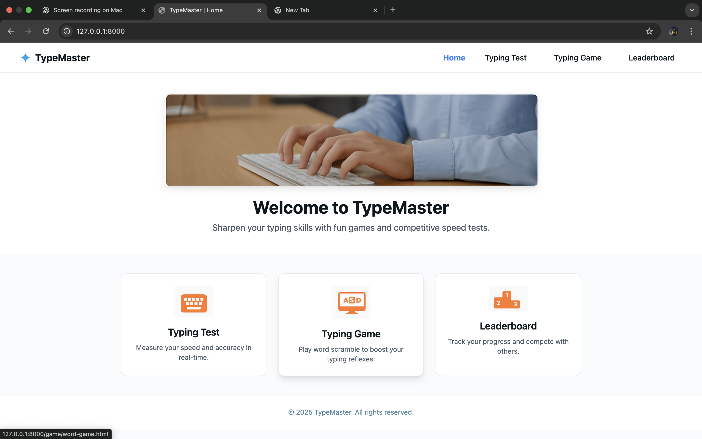
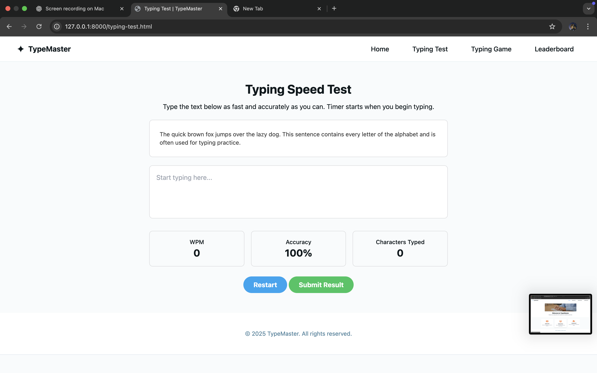
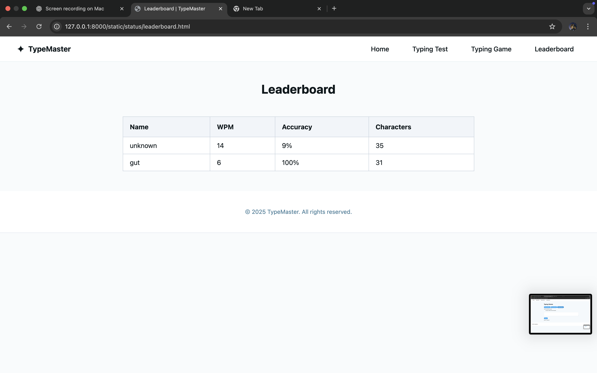
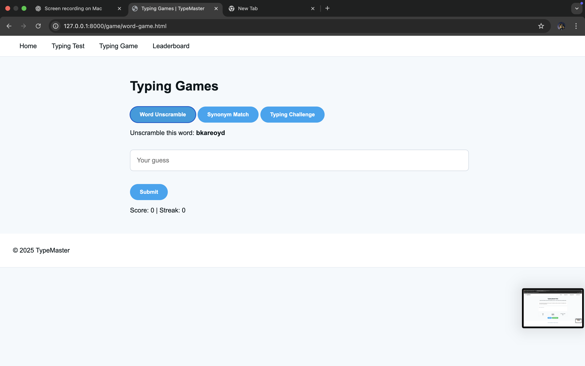
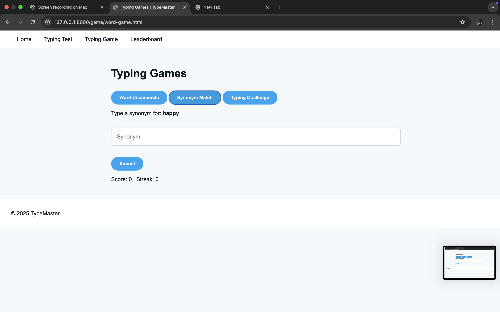
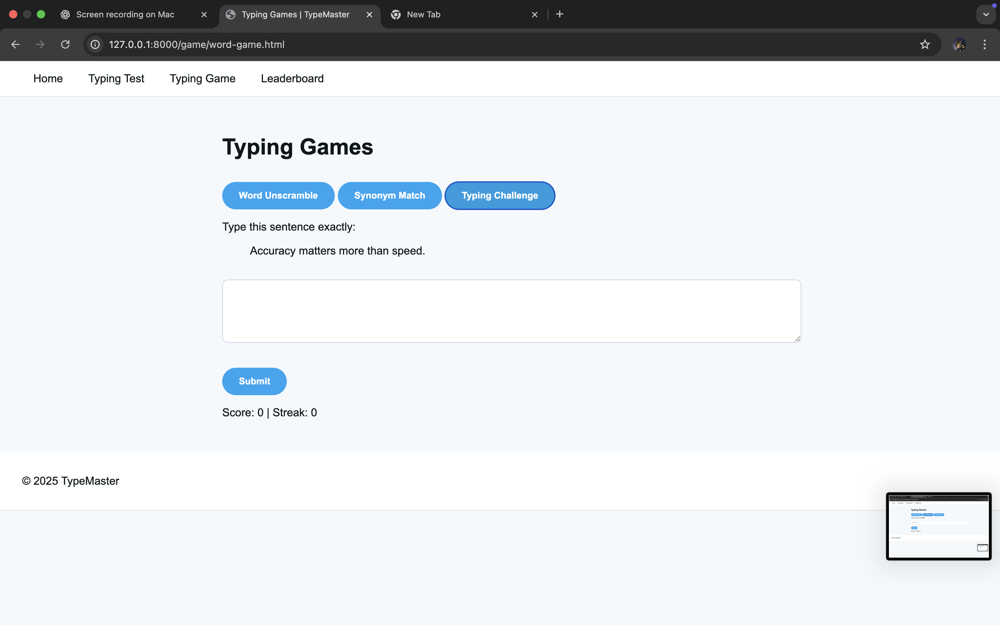

# 🚀 TypeMaster – Full-Stack Typing Speed Test Platform

TypeMaster is a full-stack web application designed to help users improve their typing speed and accuracy through real-time performance tracking and interactive word-based challenges.

The project combines a responsive frontend interface with a FastAPI backend to handle score submission and leaderboard management.

This application demonstrates frontend development, backend API integration, real-time calculation logic, and full project structuring.

---

## 🌟 Key Features

### ⌨️ Typing Speed Test
- Real-time WPM (Words Per Minute) calculation  
- Accuracy percentage tracking  
- Live character count  
- Auto timer start on first keystroke  
- Restart functionality  
- Result submission to backend  

### 🎮 Interactive Word Games
- Word Unscramble challenge  
- Synonym challenge mode  
- Sentence typing practice  
- Score & streak tracking  
- Automatic next challenge loading  

### 🏆 Leaderboard System
- Stores submitted user results  
- Displays WPM, Accuracy, and Character count  
- Backend-powered API integration  
- Dynamic table rendering  

---

## 🛠 Tech Stack

### Frontend
- HTML5  
- CSS3  
- Tailwind CSS  
- Vanilla JavaScript  

### Backend
- Python  
- FastAPI  
- REST API Endpoints  

---

## 📂 Project Structure

```
TypeMaster/
│
├── backend/                 # FastAPI backend logic
├── static/                  # Frontend files
│   ├── styles/
│   ├── scripts/
│   ├── index.html
│   ├── typing-test.html
│   ├── game/
│   └── status/
│
├── assets/                  # Screenshots
│   ├── home.png
│   ├── typing-test.png
│   ├── leaderboard.png
│   ├── game1.png
│   ├── game2.png
│   └── game3.png
│
└── main.py                  # Application entry point
```

---

## 🔌 API Endpoints

| Method | Endpoint        | Description |
|--------|----------------|------------|
| POST   | `/submit`      | Submit typing result |
| GET    | `/leaderboard` | Fetch leaderboard data |

---

## ⚙️ How To Run Locally

### 1️⃣ Clone Repository
```
git clone https://github.com/Ashwin-vg/TypeMaster.git
cd TypeMaster
```

### 2️⃣ Install Dependencies
```
pip install -r requirements.txt
```

### 3️⃣ Start FastAPI Server
```
uvicorn main:app --reload
```

### 4️⃣ Open in Browser
```
http://127.0.0.1:8000
```

---

## 📸 Screenshots

### 🏠 Home Page


### ⌨️ Typing Test


### 🏆 Leaderboard


### 🎮 Word Game




---

## 🎯 Learning Outcomes

This project demonstrates:

- Frontend–Backend integration  
- REST API communication  
- Real-time performance calculations  
- JavaScript state handling  
- FastAPI backend development  
- Project structuring & version control  
- Git-based deployment workflow  

---

## 🚀 Future Improvements

- Database integration (PostgreSQL / SQLite)  
- User authentication system  
- Difficulty levels  
- UI animation enhancements  
- Cloud deployment (Render / Railway)  

---

## 👨‍💻 Author

**Ashwin V G**  
B.Tech CSE Student  
Frontend Developer | Backend Learner | Cybersecurity Enthusiast  

---

⭐ If you found this project interesting, consider giving it a star!
